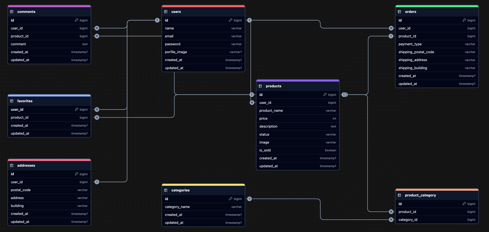

# furima

## 前提条件
- Gitがインストール済みであること
- DockerおよびDocker Composeがインストール済みであること

## 環境構築

### Dockerのビルド方法
```bash
git clone git@github.com:nihil0000/furima-mock.git .
docker compose up -d --build
```

＊ MySQLはOSによって起動しない場合があるため、それぞれのOSに合わせてdocker-compose.ymlファイルを編集してください\
＊ 開発環境がMacOS (Appleチップ) mysql, phpmyadminにて`platform: linux/amd64`を指定しています\
＊ 他のOSでMySQLが起動しない場合\
- [Docker公式ドキュメント](https://docs.docker.com/)をご参照ください。

### Laravel開発環境
```bash
# PHPコンテナにアクセス
docker compose exec php bash

# 依存関係をインストール
composer install

# .env ファイルを作成し、環境変数を設定
cp .env.example .env

## .env ファイルを以下のように編集してください。
DB_HOST=mysql
DB_DATABASE=laravel_db
DB_USERNAME=laravel_user
DB_PASSWORD=laravel_pass
MAIL_FROM_ADDRESS=test1@example.com

※StripeのAPIキーも設定してください。

# アプリケーションキーを生成
php artisan key:generate

# データベースマイグレーション & ダミーデータを生成
php artisan migrate --seed

# ストレージリンクの作成
php artisan storage:link
```

## 使用技術
- PHP 8.3.19
- Larabel 9.52.20
- MySQL 8.0.26

## ER図


## アクセスURL
- 開発環境
    - http://localhost
- phpMyAdmin
    - http://localhost:8080
- MailHog
    - http://localhost:8025

## テストアカウント
- 一般ユーザ1
   - email: test1@example.com
   - password: password
- 一般ユーザ2
   - email: test2@example.com
   - password: password
- 一般ユーザ3
   - email: test3@example.com
   - password: password

## ディレクトリ構成
```css
furima-mock
├── docker
│   ├── mysql
│   ├── nginx
│   └── php
└── src （Laravelプロジェクト）
```

## メール送信機能の確認
### 確認したい内容
商品購入者が取引を完了すると、商品出品者宛に自動で通知メールが送信されるか

### 確認方法
  1. 一般ユーザ1 or 2 or 3でログイン
  2. ログインユーザで取引チャット画面より、`取引を完了する`を押下
  3. MailHog (http://localhost:8025) にアクセス
  4. 出品者のメールアドレスに対して、`取引完了のお知らせ`メールが来ていることを確認
